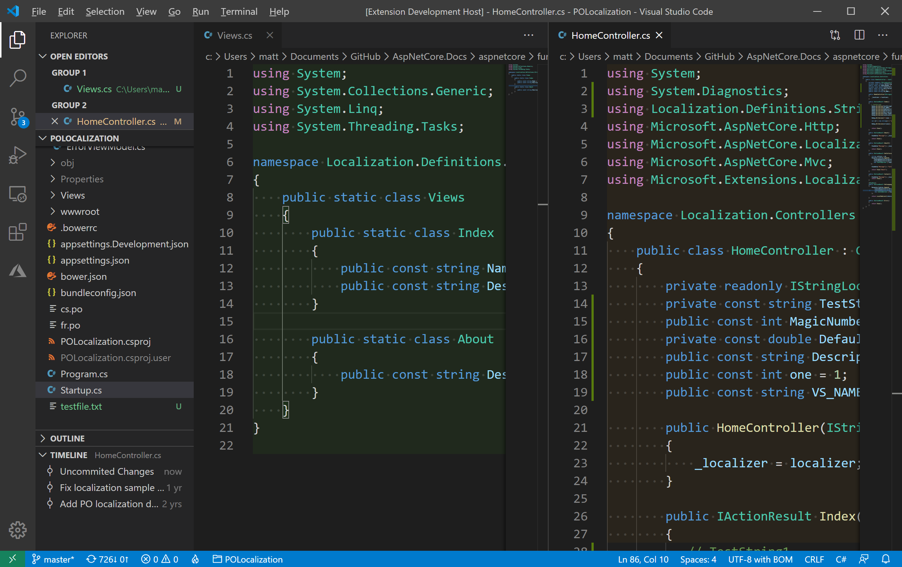
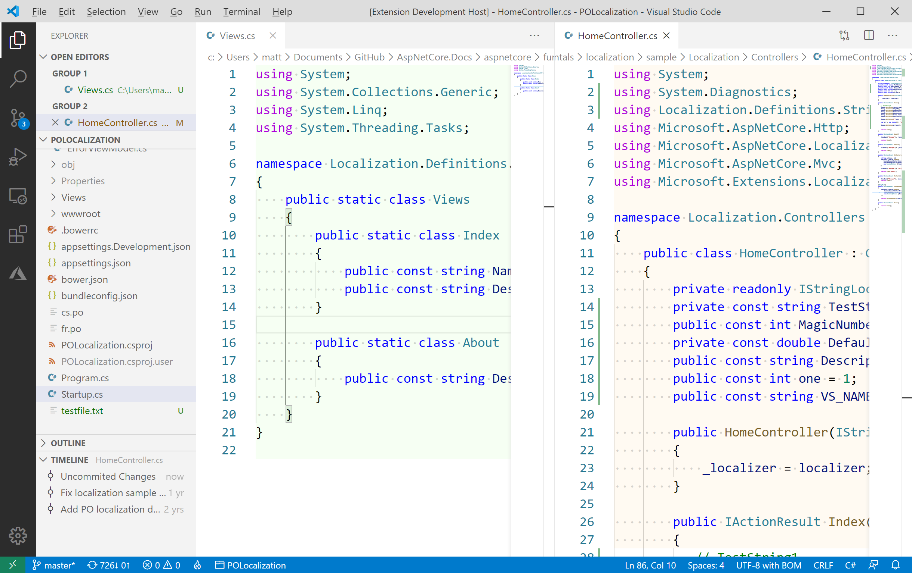

# GitStatusBg (Git Status Background)

Visual Studio Code extension that sets the background color of the editor to indicate the Git status of the file.

## Features

Any open file that has been modified or is untracked by Git will have a subtle background color applied to the editor. This is to help you easily identify such files, and help avoid making changes in the wrong place.

The images below show an open modified and untracked file open in the editor.

If you would prefer to use different colors (or they don't work with your chosen theme) the colors can be changed in settings to whatever you wish.

## Requirements

The default (built-in) GIT provider is used to get the status of files. If you're not using this, or if you're not using GIT as a source control system this extension isn't going to be of much use to you.

## Extension Settings

Settings exist to adjust the tint color that is applied to the background. Adjust based on your preference.

* `gitstatusbg.untrackedFileBackground`: the tint color to use for untracked files
* `gitstatusbg.modifiedFileBackground`: the tint color to use for modified files

## Known Issues

None yet. If you find something wrong or have a suggestion, please [raise an issue](https://github.com/mrlacey/GitStatusBg/issues).

## Release Notes

n/a

### 1.0.0

Initial release.
